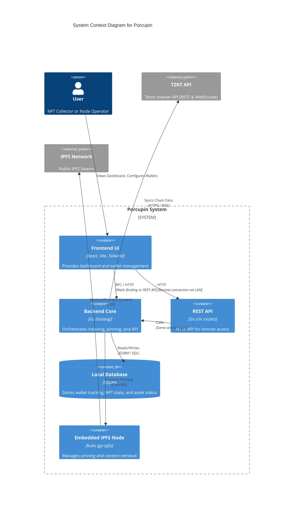
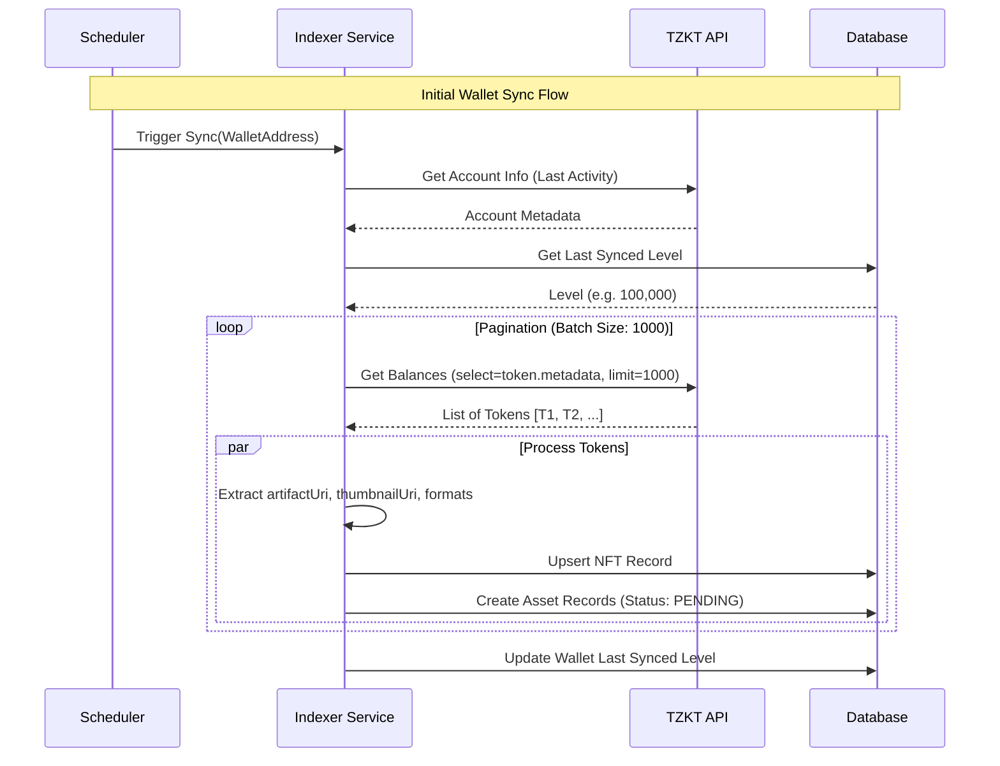
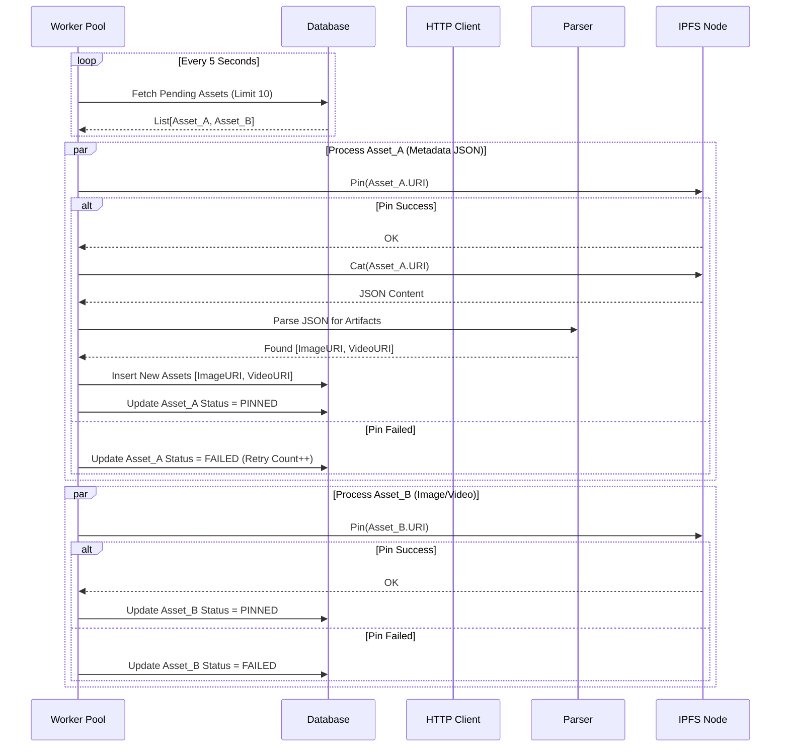
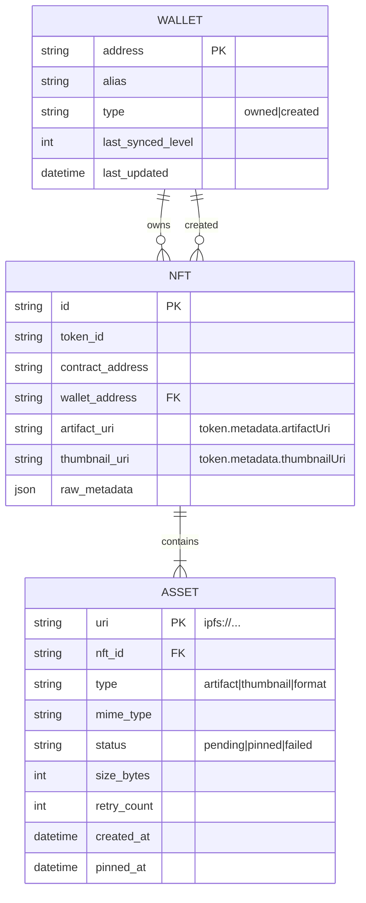

# Porcupin Architecture Document

## 1. System Overview

Porcupin is a specialized Tezos node designed for data preservation. It operates as a local bridge between the Tezos blockchain state and the IPFS distributed file system. The system is architected to be **modular**, **event-driven**, and **fault-tolerant**.

### 1.1. High-Level Container Diagram (C4)

This diagram illustrates the major containers within the Porcupin system and their interactions with external systems.



### 1.2. Deployment Modes

Porcupin supports two deployment modes:

#### Local Mode (Desktop App)

```text
┌─────────────────────────────────────────────────┐
│                  Wails Desktop App              │
│  ┌───────────┐    ┌──────────────────────────┐  │
│  │  React UI │───▶│  Go Backend (app.go)     │  │
│  └───────────┘    │    ├─ BackupService      │  │
│                   │    ├─ Database           │  │
│                   │    └─ IPFS Node          │  │
│                   └──────────────────────────┘  │
└─────────────────────────────────────────────────┘
```

#### Remote Mode (Client-Server)

```text
┌────────────────────┐         ┌─────────────────────────────────────┐
│   Desktop App      │         │        Headless Server              │
│  ┌──────────────┐  │   HTTP  │  ┌─────────────────────────────┐    │
│  │   React UI   │──┼────────▶│  │  REST API (chi router)      │    │
│  │              │  │   :8085 │  │    ├─ Auth Middleware       │    │
│  │ Remote Mode  │  │         │  │    ├─ IP Filter Middleware  │    │
│  │              │  │         │  │    └─ Rate Limiter          │    │
│  └──────────────┘  │         │  └──────────┬──────────────────┘    │
└────────────────────┘         │             │                       │
                               │             ▼                       │
                               │  ┌─────────────────────────────┐    │
                               │  │  Service Layer              │    │
                               │  │    ├─ BackupService         │    │
                               │  │    ├─ Database              │    │
                               │  │    └─ IPFS Node             │    │
                               │  └─────────────────────────────┘    │
                               └─────────────────────────────────────┘
```

## 2. Core Components & Data Flow

### 2.1. Wallet Synchronization (Indexer)

The Indexer is responsible for keeping the local state in sync with the Tezos blockchain. It uses a hybrid approach: **Historical Backfill** (REST) and **Live Updates** (WebSocket).



### 2.2. Asset Preservation (Backup Engine)

The Backup Engine consumes the `Pending` assets from the database. It is a worker-pool based system designed to handle high concurrency and network flakiness.



## 3. Data Model (ERD)

The database schema is normalized to efficiently track the relationship between Wallets, NFTs, and the underlying IPFS Assets.



## 4. Technical Specifications

### 4.1. Backend (Go)

-   **Concurrency**: Uses Go routines and channels for the worker pool.
-   **Resilience**: Implements exponential backoff for network requests.
-   **IPFS**: Uses `github.com/ipfs/kubo/core` for direct node integration, bypassing the HTTP API overhead for local operations.

### 4.2. Frontend (React + Wails)

-   **Communication**: Wails generates Javascript bindings for Go methods.
-   **State**: React Query handles polling the local backend for status updates (e.g., "5/100 Assets Pinned").

### 4.3. REST API (Headless Server)

The headless server exposes a REST API for remote management:

-   **Router**: chi (lightweight, composable HTTP router)
-   **Authentication**: Bearer token with bcrypt-hashed storage
-   **Rate Limiting**: Per-IP (10 req/s) and global (100 req/s) limits
-   **IP Filtering**: Private IP ranges only by default (RFC 1918)
-   **Service Discovery**: mDNS (Bonjour/Avahi) for automatic LAN discovery

| Component  | Package                        | Purpose                     |
| ---------- | ------------------------------ | --------------------------- |
| Router     | `github.com/go-chi/chi/v5`     | HTTP routing and middleware |
| Token Hash | `golang.org/x/crypto/bcrypt`   | Secure token storage        |
| Rate Limit | `golang.org/x/time/rate`       | Token bucket rate limiting  |
| mDNS       | `github.com/grandcat/zeroconf` | Service advertisement       |

### 4.4. Security & Isolation

-   **Docker**: The headless version runs in a distroless container to minimize attack surface.
-   **Local Storage**: Data is stored in `XDG_DATA_HOME/porcupin` (Linux) or `~/Library/Application Support/porcupin` (macOS), ensuring standard OS compliance.
-   **Token Security**: API tokens are shown once on generation; only bcrypt hashes are stored.
