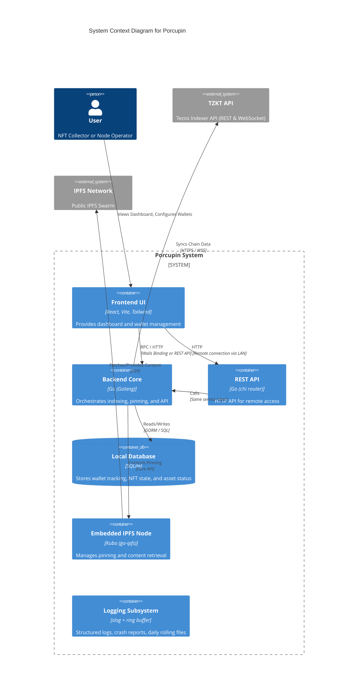
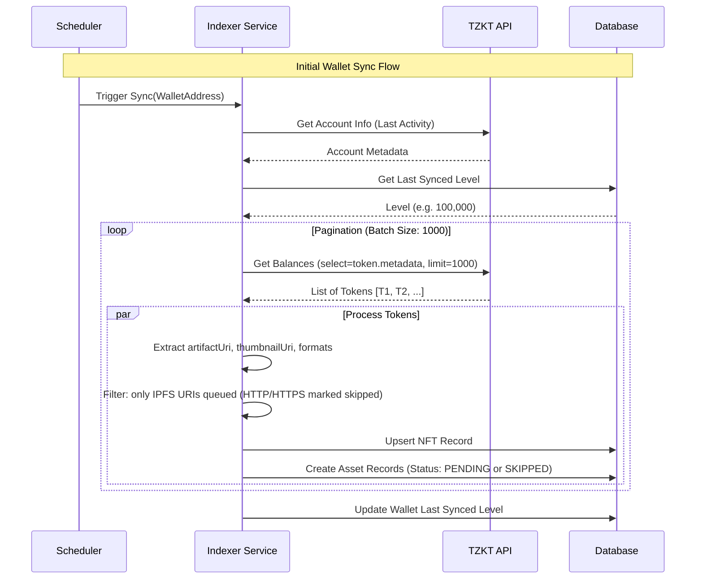
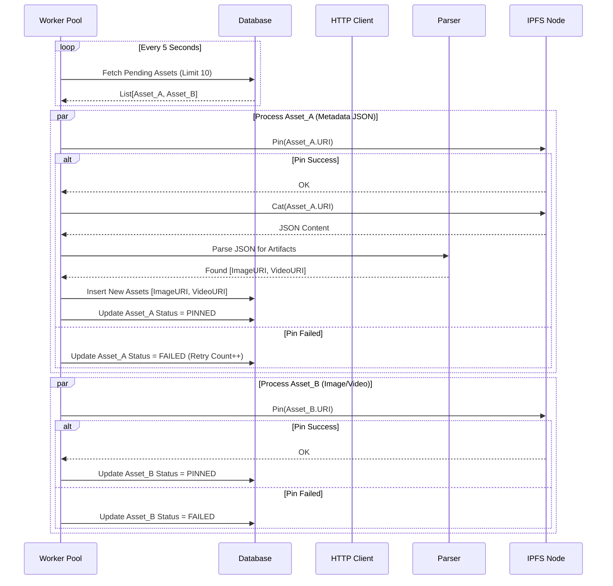
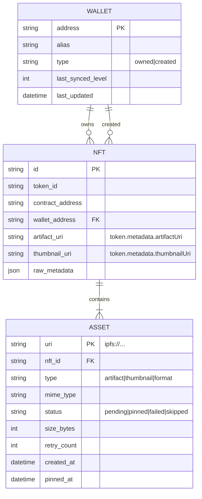

# Porcupin Architecture Document

## 1. System Overview

Porcupin is a specialized Tezos node designed for data preservation. It operates as a local bridge between the Tezos blockchain state and the IPFS distributed file system. The system is architected to be **modular**, **event-driven**, and **fault-tolerant**.

### 1.1. High-Level Container Diagram (C4)

This diagram illustrates the major containers within the Porcupin system and their interactions with external systems.


```mermaid
C4Context
    title System Context Diagram for Porcupin

    Person(user, "User", "NFT Collector or Node Operator")

    System_Boundary(porcupin, "Porcupin System") {
        Container(ui, "Frontend UI", "React, Vite, Tailwind", "Provides dashboard and wallet management")
        Container(backend, "Backend Core", "Go (Golang)", "Orchestrates indexing, pinning, and API")
        Container(api, "REST API", "Go (chi router)", "HTTP API for remote access")
        ContainerDb(db, "Local Database", "SQLite", "Stores wallet tracking, NFT state, and asset status")
        Container(ipfs, "Embedded IPFS Node", "Kubo (go-ipfs)", "Manages pinning and content retrieval")
        Container(logging, "Logging Subsystem", "slog + ring buffer", "Structured logs, crash reports, daily rolling files")
    }

    System_Ext(tzkt, "TZKT API", "Tezos Indexer API (REST & WebSocket)")
    System_Ext(ipfs_net, "IPFS Network", "Public IPFS Swarm")

    Rel(user, ui, "Views Dashboard, Configures Wallets")
    Rel(ui, backend, "RPC / HTTP", "Wails Binding or REST API")
    Rel(ui, api, "HTTP", "Remote connection via LAN")
    Rel(api, backend, "Calls", "Same service layer")
    Rel(backend, db, "Reads/Writes", "GORM / SQL")
    Rel(backend, tzkt, "Syncs Chain Data", "HTTPS / WSS")
    Rel(backend, ipfs, "Controls Pinning", "Core API")
    Rel(ipfs, ipfs_net, "Fetches/Provides Content", "P2P")
```

### 1.2. Deployment Modes

Porcupin supports two deployment modes:

#### Local Mode (Desktop App)

```text
┌─────────────────────────────────────────────────┐
│                  Wails Desktop App              │
│  ┌───────────┐    ┌──────────────────────────┐  │
│  │  React UI │───▶│  Go Backend (app.go)     │  │
│  └───────────┘    │    ├─ BackupService      │  │
│                   │    ├─ Database           │  │
│                   │    └─ IPFS Node          │  │
│                   └──────────────────────────┘  │
└─────────────────────────────────────────────────┘
```

#### Remote Mode (Client-Server)

```text
┌────────────────────┐         ┌─────────────────────────────────────┐
│   Desktop App      │         │        Headless Server              │
│  ┌──────────────┐  │   HTTP  │  ┌─────────────────────────────┐    │
│  │   React UI   │──┼────────▶│  │  REST API (chi router)      │    │
│  │              │  │   :8085 │  │    ├─ Auth Middleware       │    │
│  │ Remote Mode  │  │         │  │    ├─ IP Filter Middleware  │    │
│  │              │  │         │  │    └─ Rate Limiter          │    │
│  └──────────────┘  │         │  └──────────┬──────────────────┘    │
└────────────────────┘         │             │                       │
                               │             ▼                       │
                               │  ┌─────────────────────────────┐    │
                               │  │  Service Layer              │    │
                               │  │    ├─ BackupService         │    │
                               │  │    ├─ Database              │    │
                               │  │    └─ IPFS Node             │    │
                               │  └─────────────────────────────┘    │
                               └─────────────────────────────────────┘
```

## 2. Core Components & Data Flow

### 2.1. Wallet Synchronization (Indexer)

The Indexer is responsible for keeping the local state in sync with the Tezos blockchain. It uses a hybrid approach: **Historical Backfill** (REST) and **Live Updates** (WebSocket).


```mermaid
sequenceDiagram
    participant S as Scheduler
    participant I as Indexer Service
    participant T as TZKT API
    participant D as Database

    Note over S, D: Initial Wallet Sync Flow

    S->>I: Trigger Sync(WalletAddress)
    I->>T: Get Account Info (Last Activity)
    T-->>I: Account Metadata

    I->>D: Get Last Synced Level
    D-->>I: Level (e.g. 100,000)

    loop Pagination (Batch Size: 1000)
        I->>T: Get Balances (select=token.metadata, limit=1000)
        T-->>I: List of Tokens [T1, T2, ...]

        par Process Tokens
            I->>I: Extract artifactUri, thumbnailUri, formats
            I->>I: Filter: only IPFS URIs queued (HTTP/HTTPS marked skipped)
            I->>D: Upsert NFT Record
            I->>D: Create Asset Records (Status: PENDING or SKIPPED)
        end
    end

    I->>D: Update Wallet Last Synced Level
```

### 2.2. Asset Preservation (Backup Engine)

The Backup Engine consumes the `Pending` assets from the database. It is a worker-pool based system designed to handle high concurrency and network flakiness.


```mermaid
sequenceDiagram
    participant W as Worker Pool
    participant D as Database
    participant H as HTTP Client
    participant P as Parser
    participant IPFS as IPFS Node

    loop Every 5 Seconds
        W->>D: Fetch Pending Assets (Limit 10)
        D-->>W: List[Asset_A, Asset_B]
    end

    par Process Asset_A (Metadata JSON)
        W->>IPFS: Pin(Asset_A.URI)
        alt Pin Success
            IPFS-->>W: OK
            W->>IPFS: Cat(Asset_A.URI)
            IPFS-->>W: JSON Content

            W->>P: Parse JSON for Artifacts
            P-->>W: Found [ImageURI, VideoURI]

            W->>D: Insert New Assets [ImageURI, VideoURI]
            W->>D: Update Asset_A Status = PINNED
        else Pin Failed
            W->>D: Update Asset_A Status = FAILED (Retry Count++)
        end
    end

    par Process Asset_B (Image/Video)
        W->>IPFS: Pin(Asset_B.URI)
        alt Pin Success
            IPFS-->>W: OK
            W->>D: Update Asset_B Status = PINNED
        else Pin Failed
            W->>D: Update Asset_B Status = FAILED
        end
    end
```

## 3. Data Model (ERD)

The database schema is normalized to efficiently track the relationship between Wallets, NFTs, and the underlying IPFS Assets.


```mermaid
erDiagram
    WALLET ||--o{ NFT : owns
    WALLET ||--o{ NFT : created
    NFT ||--|{ ASSET : contains

    WALLET {
        string address PK
        string alias
        string type "owned|created"
        int last_synced_level
        datetime last_updated
    }

    NFT {
        string id PK
        string token_id
        string contract_address
        string wallet_address FK
        string artifact_uri "token.metadata.artifactUri"
        string thumbnail_uri "token.metadata.thumbnailUri"
        json raw_metadata
    }

    ASSET {
        string uri PK "ipfs://..."
        string nft_id FK
        string type "artifact|thumbnail|format"
        string mime_type
        string status "pending|pinned|failed|skipped"
        int size_bytes
        int retry_count
        datetime created_at
        datetime pinned_at
    }
```

## 4. Technical Specifications

### 4.1. Backend (Go)

- **Concurrency**: Uses Go routines and channels for the worker pool. WaitGroup tracking ensures graceful shutdown waits for all goroutines to complete.
- **Resilience**: Implements exponential backoff for network requests. Panic recovery wrappers on all unprotected goroutines.
- **IPFS**: Uses `github.com/ipfs/kubo/core` for direct node integration, bypassing the HTTP API overhead for local operations.
- **Content Routing**: The embedded node runs a DHT **client** (low resource, non-server) **combined with delegated HTTP routing to the IPNI indexer** (`cid.contact`, resolved via Kubo AutoConf). This is essential: most NFT content (Versum, Emprops, and anything stored via nft.storage / web3.storage / Filecoin) advertises its provider records to the IPNI indexer only, leaving the Amino DHT without them. A DHT-only node cannot discover those providers and pins time out even though the content is widely available. Configured via `ipfs.delegated_routers` (default `["auto"]`; `"auto"` → IPNI). See `getRoutingOption` in `backend/ipfs/profile_default.go` and `applyDelegatedRouters` / `SanitizeDelegatedRouters` in `backend/ipfs/routing.go`. The `IPFS_HTTP_ROUTERS` environment variable overrides the config for a single run.
- **Logging**: Structured logging via `slog` with a multi-handler fan-out to stderr, an in-memory ring buffer (1000 entries), and daily rotating log files.
- **Health Monitoring**: Periodic IPFS health checks reporting online/offline status and connected peer count via Kubo's Swarm API.

### 4.2. Logging & Diagnostics

Porcupin uses a structured logging subsystem built on Go's `log/slog`:

- **Multi-handler fan-out**: Log records are sent simultaneously to stderr, an in-memory ring buffer, and daily rotating log files.
- **In-memory ring buffer**: The most recent 1000 log entries are kept in memory for the UI log viewer (`GetLogs` Wails binding).
- **Rolling log files**: Daily log files written to `~/.porcupin/logs/porcupin-YYYY-MM-DD.log` with configurable retention.
- **Crash reports**: A panic recovery wrapper captures goroutine stacks and writes crash reports to `~/.porcupin/logs/crash-*.txt`.
- **Export**: Users can export logs and full diagnostic reports (including system info, config, and recent logs) via native file dialogs from the Settings UI.

| Component     | Package                    | Purpose                                     |
| ------------- | -------------------------- | ------------------------------------------- |
| Multi-handler | `backend/logging/multi.go` | Fan-out slog handler (stderr + ring + file) |
| Ring buffer   | `backend/logging/ring.go`  | In-memory log storage for UI log viewer     |
| File handler  | `backend/logging/file.go`  | Daily rolling log files with retention      |
| Crash report  | `backend/logging/crash.go` | Panic recovery and crash report writer      |

### 4.3. IPFS Health Monitoring

The backend periodically checks IPFS node health and exposes the result to the frontend:

- **Health check**: `NodeHealthResult` struct with `IsOnline` (bool) and `PeerCount` (int) via Kubo's Swarm API.
- **Dashboard indicator**: Green/red health dot in the navigation bar.
- **Wails events**: `ipfs:health` event emitted on state changes so the frontend updates without polling.
- **Remote mode**: Health data is served via the `/api/v1/health` endpoint with `is_online` and `peer_count` fields.

### 4.4. Frontend (React + Wails)

- **Communication**: Wails generates Javascript bindings for Go methods.
- **State**: React Query handles polling the local backend for status updates (e.g., "5/100 Assets Pinned").

### 4.5. REST API (Headless Server)

The headless server exposes a REST API for remote management:

- **Router**: chi (lightweight, composable HTTP router)
- **Authentication**: Bearer token with bcrypt-hashed storage
- **Rate Limiting**: Per-IP (10 req/s) and global (100 req/s) limits
- **IP Filtering**: Private IP ranges only by default (RFC 1918)
- **Service Discovery**: mDNS (Bonjour/Avahi) for automatic LAN discovery

| Component  | Package                        | Purpose                     |
| ---------- | ------------------------------ | --------------------------- |
| Router     | `github.com/go-chi/chi/v5`     | HTTP routing and middleware |
| Token Hash | `golang.org/x/crypto/bcrypt`   | Secure token storage        |
| Rate Limit | `golang.org/x/time/rate`       | Token bucket rate limiting  |
| mDNS       | `github.com/grandcat/zeroconf` | Service advertisement       |

### 4.6. Security & Isolation

- **Docker**: The headless version runs in a distroless container to minimize attack surface.
- **Local Storage**: Data is stored in `XDG_DATA_HOME/porcupin` (Linux) or `~/Library/Application Support/porcupin` (macOS), ensuring standard OS compliance.
- **Token Security**: API tokens are shown once on generation; only bcrypt hashes are stored.
